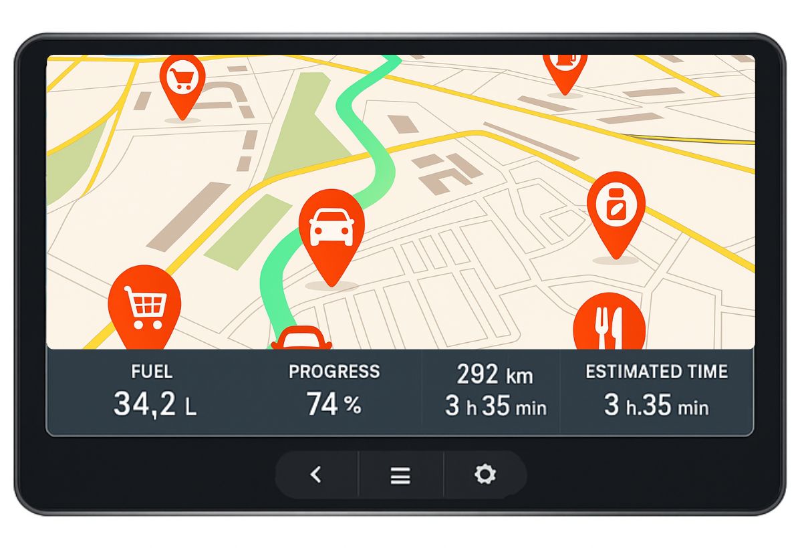

# Sistema de inteligência veicular com roteamento e gestão de autonomia em tempo real.

Este projeto simula viagens veiculares com foco em sistemas embarcados, realizando estimativas de percurso, consumo de combustível, tempo restante e progresso, tudo com base em rotas reais geradas pela API do [OpenRouteService](https://openrouteservice.org/).

---

## Funcionalidades

- Simulação completa de rotas entre dois pontos geográficos
- Cálculo automático de autonomia e necessidade de reabastecimento
- Acompanhamento da viagem em tempo real via `/progress`
- Finalização automática ou manual da rota
- Armazenamento dos pontos geográficos e dados da simulação
- Precisão nos cálculos com controle de casas decimais

---

## Tecnologias

- **Java 17+**
- **Spring Boot 3**
- **JPA/Hibernate**
- **PostgreSQL** (No projeto foi usado banco em memória H2)
- **WebClient** para consumo da API externa
- **OpenRouteService API** para cálculo de rotas

---

## Aplicações embarcadas veiculares

Este projeto foi concebido para ser **integrado nativamente à central multimídia do veículo**, oferecendo ao motorista uma experiência embarcada sob medida. Pode ser embarcado de fábrica, apresentando:

- Informações de trajeto, combustível e autonomia em tempo real
- Finalização automática da viagem ao atingir o destino
- Operação sem necessidade de conexão constante com a internet
- Design adaptado à identidade visual da montadora
- Potencial futuro para integração com sensores reais via CAN bus (tanque, odômetro, velocidade)

> Essa abordagem torna o projeto ideal para centrais OEM, frotas inteligentes ou painéis embarcados customizados.

---

## Visão do painel (simulação)

Abaixo está uma ilustração simulando como este sistema pode aparecer em uma central multimídia nativa de um veículo:



---

## Estrutura de Endpoints

### `POST /rides/simulate`

Cria uma simulação com origem, destino, veículo e combustível atual. Request:

```json
{
  "originLatitude": -8.027559138140562,
  "originLongitude": -34.91792018646284,
  "destinationLatitude": -9.75856613374812,
  "destinationLongitude": -36.64957203420331,
  "currentFuelLiters": 40.0,
  "vehicleId": 1
}
```

Response:

```json
{
  "id": 1,
  "originLatitude": -8.027559138140562,
  "originLongitude": -34.91792018646284,
  "destinationLatitude": -9.75856613374812,
  "destinationLongitude": -36.64957203420331,
  "distanceKm": 348.68,
  "durationMinutes": 268.0,
  "currentFuelLiters": 40.0,
  "litersToRefuel": 0.0,
  "vehicleModel": "Carro X",
  "status": "PENDING",
  "progressPercentage": 0.0,
  "route": [
    {
      "latitude": -8.02724,
      "longitude": -34.91743,
      "positionInRoute": 0
    },
    {
      "latitude": -8.027947,
      "longitude": -34.91696,
      "positionInRoute": 1
    },
    {
      "latitude": -8.028169,
      "longitude": -34.916862,
      "positionInRoute": 2
    }
  ]
}
```

---

### `PATCH /rides/{id}/start`

Inicia a simulação. Altera o status para `STARTED`.

---

### `PATCH /rides/{id}/progress`

Atualiza o ponto atual na rota e retorna:

- **Durante a viagem**:

```json
{
  "id": 1,
  "currentFuelLiters": 34.76,
  "progressPercentage": 19.83,
  "estimatedTimeRemainingMinutes": 214.86,
  "estimatedDistanceRemainingKm": 279.54,
  "status": "STARTED"
}
```

- **Ao finalizar (100%)**:

```json
{
  "rideId": 1,
  "status": "FINISHED",
  "distanceTraveled": 348.68,
  "fuelRemaining": 12.1,
  "startedAt": "2025-06-21T19:03:15.951809Z",
  "finishedAt": "2025-06-21T19:03:51.385908Z"
}
```

---

### `PATCH /rides/{id}/finish`

Finaliza manualmente a simulação. Mesma resposta acima.

---

## Configuração da API externa

A chave da API OpenRouteService é lida de uma variável de ambiente:

```properties
# application.properties
open.route.service.api.token=${OPEN_ROUTE_TOKEN}
```

Certifique-se de definir a variável no ambiente de execução:

```bash
export OPEN_ROUTE_TOKEN=seu_token_aqui
```

---

## Convenções e precisão

- Todos os valores numéricos (litros, km, tempo) são salvos com duas casas decimais
- O backend nunca consulta a API de rota mais de uma vez por viagem
- O sistema detecta automaticamente a chegada ao fim da rota via `/progress`

---

## Estrutura dos DTOs

- `RideRequestDTO`: entrada para criar simulação
- `RideResponseDTO`: resposta completa com rota, consumo estimado etc.
- `RideProgressResponseDTO`: resposta enxuta do progresso
- `RideFinalizationResponseDTO`: resposta final quando a rota termina
- `RideProgressRequestDTO`: contém apenas o `positionInRoute`
- `CoordinateDTO`: representa os pontos da rota

---

## Rodando localmente

```bash
# Compilação
./mvnw clean install

# Execução
./mvnw spring-boot:run
```

Certifique-se de ter a obter o token da API e configurar a variável de ambiente.

---

Desenvolvido por [Matheus Valdevino](https://github.com/matheusvsdev).

---

